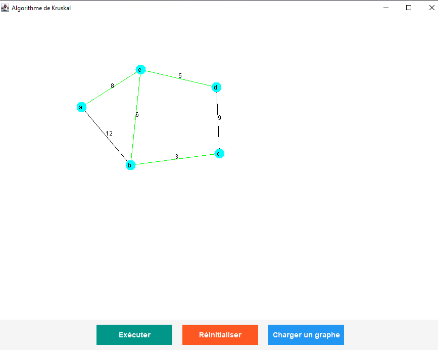

<a id="readme-top"></a>

<!-- PROJECT LOGO -->
<br />
<div align="center">


  <h3 align="center">Kruskal's Algorithm</h3>

  <p align="center">
    A Java-based implementation of Kruskal's Algorithm to find the Minimum Spanning Tree (MST) of a connected, undirected, and weighted graph.
  </p>
</div>

<!-- TABLE OF CONTENTS -->
<details>
  <summary>Table of Contents</summary>
  <ol>
    <li>
      <a href="#about-the-project">About The Project</a>
      <ul>
        <li><a href="#built-with">Built With</a></li>
      </ul>
    </li>
    <li><a href="#screenshots">Screenshots</a></li>
    <li>
      <a href="#getting-started">Getting Started</a>
      <ul>
        <li><a href="#prerequisites">Prerequisites</a></li>
        <li><a href="#installation">Installation</a></li>
      </ul>
    </li>
    <li><a href="#contact">Contact</a></li>
  </ol>
</details>

<!-- ABOUT THE PROJECT -->
## About The Project

<a href="https://github.com/Hamza-Alali-0/Kruskal">
    
</a>

This project focuses on implementing **Kruskal's Algorithm** to efficiently find the **Minimum Spanning Tree (MST)** of a connected, undirected, and weighted graph. By leveraging this algorithm, the project aims to solve real-world optimization problems, such as network design, cluster analysis, and resource allocation, while ensuring minimal total edge weight and no cycles in the resulting tree.

Here's why this project stands out:
- **Efficient Algorithm**: Kruskal's Algorithm provides a systematic approach to constructing an MST by sorting edges and iteratively adding the smallest edge that does not form a cycle.
- **User-Friendly Interface**: Includes a graphical interface for inputting graph data, visualizing the graph, and displaying the resulting MST.
- **Practical Applications**: Demonstrates the use of graph algorithms in solving complex optimization challenges across various domains.

### Built With

This project is built with the following technologies:

* [![Java][Java.com]][Java-url]
* [![Java Swing][Java-Swing.com]][Java-Swing-url]

<!-- Reference-style links for images -->
[Java.com]: https://img.shields.io/badge/Java-ED8B00?style=for-the-badge&logo=openjdk&logoColor=white
[Java-url]: https://www.java.com/
[Java-Swing.com]: https://img.shields.io/badge/Java_Swing-ED8B00?style=for-the-badge&logo=java&logoColor=white
[Java-Swing-url]: https://docs.oracle.com/javase/tutorial/uiswing/

<p align="right">(<a href="#readme-top">back to top</a>)</p>

<!-- SCREENSHOTS -->
## Screenshots

Here are some screenshots of the project:

| ![Home Page][home-screenshot] | ![Simulation 1][example1-screenshot] | ![Simulation 2][example2-screenshot] |
|-------------------------------|--------------------------------------|--------------------------------------|
| **Simulation Page**                 | **Simulation 1**                    | **Simulation 2**                    |

<!-- Reference-style links for images -->
[home-screenshot]: Assets/example1.png
[example1-screenshot]: Assets/example2.png
[example2-screenshot]: Assets/example3.png

<p align="right">(<a href="#readme-top">back to top</a>)</p>

<!-- GETTING STARTED -->
## Getting Started

To get a local copy up and running, follow these simple steps.

### Prerequisites

Before you begin, ensure you have the following installed:
- [Java Development Kit (JDK)](https://www.oracle.com/java/technologies/javase-downloads.html) (version 8 or higher)
- An Integrated Development Environment (IDE) such as [IntelliJ IDEA](https://www.jetbrains.com/idea/) or [Eclipse](https://www.eclipse.org/downloads/).

### Installation

1. **Clone the repository**:
   ```sh
   git clone https://github.com/Hamza-Alali-0/Kruskal.git

   
<a id="contact"></a>
## Contact

Hamza Alali - [hamza.alali.dev@gmail.com](mailto:hamza.alali.dev@gmail.com)


Connect with me:
- <a href="https://dev.to/@hamzaalali0" target="_blank"></a>
- <a href="https://www.linkedin.com/in/hamza--alali" target="_blank"></a>
- <a href="https://github.com/hamza-alali-0" target="_blank"></a>
- <a href="https://www.instagram.com/alalihamza.0/" target="_blank"></a>

Project Link: [https://github.com/Hamza-Alali-0/kruskal](https://github.com/Hamza-Alali-0/kruskal)

<p align="right">(<a href="#readme-top">back to top</a>)</p>
   
